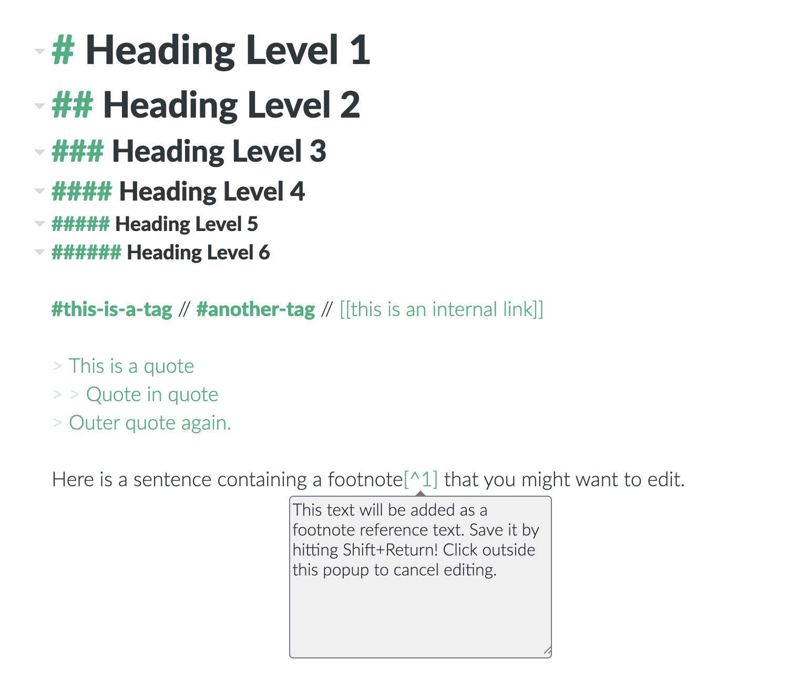

# Zettlr in 5 Minutes

Okay, you have downloaded and installed the app, got a clock set and are ready to roll? Then hit that countdown button and let's go!

## 1. Open directories and files

To open directories or files, simply drag them anywhere over the app's window. They will be opened automatically. You can also hit `Cmd/Ctrl+O` to open the directory select dialog, if that's faster for where you're going.

## 2. Create files and directories

After opening a directory, you need a file. Hit `Cmd/Ctrl+N` to create a new file. Type a file name, hit `Return` and select the editor. Need another directory? `Cmd/Ctrl+Shift+N` will do the job.

> You can not only add Markdown files! If you do not provide an extension, Zettlr will add the extension `.md` for you. But you can also create `.txt`-files and `.tex`-files, you just need to provide that file extension!

## 3. Write!

Writing is up to you, but here's the most important keystrokes to remember:

- `Cmd/Ctrl+I`: Make text \__italic_\_. Works just like in Word.
- `Cmd/Ctrl+B`: Make text \*\***bold**\*\*. Also works just like in Word.
- `Cmd+Alt+R` (macOS) `Ctrl+Alt+F` (Windows/Linux): Create a footnote.
- `Alt/Ctrl+Click` (on a footnote reference): Edit a footnote. Hit `Shift+Enter` to finish editing.
- `Cmd/Ctrl+K`: Insert a link. (`Alt/Ctrl+Click` it to open the link.)
- `Cmd/Ctrl+J`: Enter the distraction-free mode.
- `Cmd/Ctrl+Alt+L`: Toggle the theme between light and dark mode.

Things without keystrokes, but also important:

- Use `#`-signs to create headings. The number of `#`-symbols equals the level of the heading. Maximum is 6.
- Use `>`-signs to create blockquotes. You can also nest them using multiple greater-than-signs (e.g. `> >`).
- Use `#`-signs _not_ followed by a space to create tags. You can use these tags for searching and navigating.

## 4. What else?

If you use the thin sidebar mode (the default), you will see either the file list or the directory tree. Move the mouse to the top-left corner of the file list and click the arrow to show the directory tree. To toggle between file list and directory tree, you can also hit `Cmd/Ctrl+!`. Choose the extended sidebar mode in the preferences to have both the file list and the directory tree visible at once.

Zettlr is strictly context-based. Unless otherwise specified, new files and directories will be created inside the currently selected directory. File-based operations (renaming or deleting) will by default target the current file. Use the context menu by right-clicking any file or directory to select specific files/directories.

Three simple rules of thumb:

1. The `Alt`(ernative) key triggers alternative actions on the same element.
2. The `Shift` modifier key _shifts_ the target of an action to another element (mostly the directory instead of the file).
3. All crucial actions are located in the toolbar. Left are general actions, middle are file-based actions, and to the right are other actions.

## 5. Nice, I've finished writing. How do I share it?

Three easy steps:

1. Make sure Pandoc and LaTeX (only necessary for PDF) are installed.
2. Click the share button in the toolbar (or hit `Cmd/Ctrl+E`) and select the target format. The aperture reveals the presentations (they are made using reveal.js — get the pun?)
3. On export, Zettlr opens the exported file automatically in your preferred app. In there, hit `Cmd/Ctrl+Shift+S` (should work in most apps) to save it where ever you want.

## 6. Okay, the 5 mins are over, something else?

Nope, you're good to go. If you want to dive deeper, be sure to check out our guides:

- [Zettlr as a note-taking app](guides/guide-notes.md)
- [Zettlr as a Zettelkasten](guides/guide-zettelkasten.md)
- [Zettlr as an IDE](guides/guide-ide.md)
