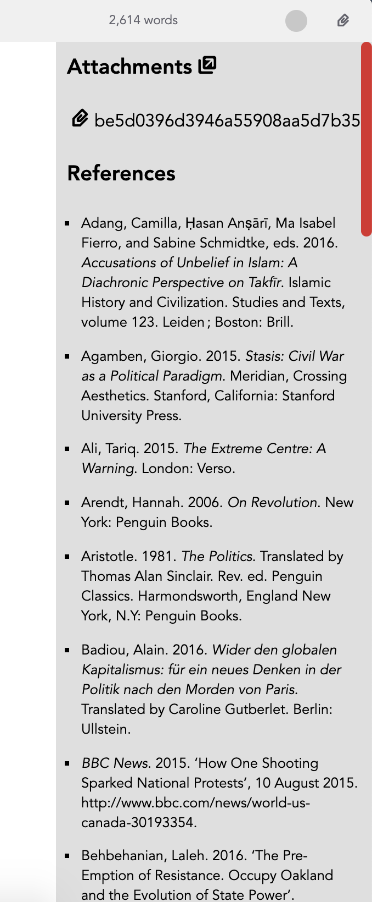
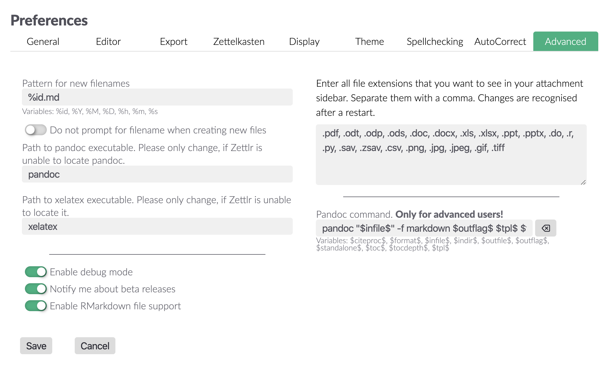

# 添付ファイルサイドバー

添付ファイルサイドバーは、現在のディレクトリとファイルに関連する追加情報を表示するコンテキスト依存の要素です。ツールバーのクリップのアイコンをクリックするか、`Cmd/Ctrl+?`を押すと開くことができます。

サイドバーの中に2つのエリアがあります。一つ目は「添付ファイル」と書かれていて、現在選択中のフォルダにある、Markdown以外の追加のファイルの一覧を表示します。画像、Wordドキュメント、PDFファイルなど、その他の形式のファイルです。ここに表示するファイルの拡張子は、設定ダイアログの「高度な設定」にある設定項目で追加することができます。この拡張子は、大文字小文字を無視するので、`.jpeg`を追加すれば、`.jpeg`だけでなく`.JPEG`や`.JpEg`のファイルも表示されるようになります。

二つ目のエリアは、「参考文献」と書かれていて、現在開いているMarkdownファイルに含まれる参考文献の一覧を表示します。これは、Markdownのエクスポート時に`pandoc-citeproc`により作られる、参考文献リストに類似しています。これによって、文書を引用するのに、正しいcitekeyを使うことができているかを確認することができます。

## 添付ファイル

添付ファイルサイドバーに表示されたファイルリストは、ファイル閲覧ウィンドウを毎回開く代わりのものと思ってください。これによって、追加で作業する必要のあるファイルをZettlrから見ることができ、ワークフローの管理を行いやすくします。

現在選択中のディレクトリに含まれるすべてのファイルを見る必要がある場合は、添付ファイルというタイトルの右の、ポップアウトアイコンをクリックすると、デフォルトのファイルブラウザーでディレクトリを開くことができます。

サイドバーのファイルをクリックすると、システムのデフォルトアプリケーションで、そのファイルを開きます。ファイルブラウザーでファイルをダブルクリックするのと同じです。また、ファイルをMarkdownドキュメント上にドラッグアンドドロップすることもできます。そうすると、ファイルへのリンクが作成され、ドキュメントからファイルを参照することができます。多くの場合、この機能は画像のために使います。Zettlrが一般的な画像ファイルの拡張子を検出すると、それを、リンクタグではなく画像タグに変換します。これによって、フォルダから画像をドラッグして、編集中のファイルに簡単に追加することができます。サブフォルダーから画像を追加するには、ファイルリストのツリービューで、該当のサブフォルダを選択するだけです。そうすると、添付ファイルサイドバーに表示される画像が、選択したフォルダのものに更新されます。

## 参考文献

参考文献はMarkdownファイルに含まれる引用元の一覧です。これは、組み込みのCSLスタイルを用いて正しい引用元リストを表示するためだけの機能です。引用したものを一目で見られるようにして、正しい引用元かどうか、忘れているものがないかを確認する手段を提供します。

添付ファイルサイドバーは、集中モードを設定しても表示され続け、文書を書きながら参考文献一覧を横に並べて表示することができます。
